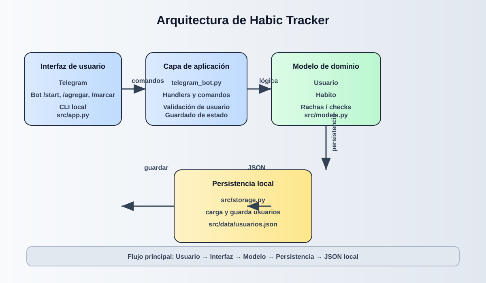

# Habic Tracker

Habic Tracker es un proyecto para registrar hábitos diarios, hacer seguimiento de rachas y conservar la información en un archivo JSON local. El sistema cuenta con dos interfaces principales: una versión de línea de comandos y un bot de Telegram para usarlo desde el chat.

## ¿Qué hace?

- Agregar hábitos personalizados.
- Marcar si un hábito fue completado hoy.
- Consultar el estado del día.
- Mostrar streaks o rachas consecutivas.
- Eliminar hábitos no deseados.
- Persistir datos entre ejecuciones.

## Arquitectura

La aplicación sigue una estructura simple basada en capas:

- Interfaz de usuario: terminal o Telegram.
- Lógica de dominio: clases `Usuario` y `Habito`.
- Persistencia: lectura y escritura de datos en JSON.



## Estructura del proyecto

- `telegram_bot.py`: bot principal de Telegram con comandos como `/start`, `/agregar`, `/marcar`, `/hoy`, `/streaks` y `/listar`.
- `src/app.py`: versión de consola para interactuar con el sistema de forma local.
- `src/models.py`: definiciones del modelo de dominio (`Usuario`, `Habito`).
- `src/storage.py`: carga y guarda la información en el archivo JSON.
- `src/data/usuarios.json`: base de datos local en formato JSON.
- `.env`: archivo de configuración con el token del bot de Telegram.

## Requisitos

- Python 3.12 o superior
- Dependencias del proyecto:
  - `python-dotenv`
  - `python-telegram-bot`

## Instalación

1. Clona el repositorio.
2. Crea un entorno virtual e instala las dependencias.

```bash
uv sync
```

3. Crea un archivo `.env` en la raíz con tu token de Telegram:

```env
TELEGRAM_TOKEN=tu_token_aqui
```

## Ejecución

### Modo CLI

Desde la raíz del proyecto o dentro de la carpeta `src`:

```bash
cd src
python app.py
```

### Modo Telegram

```bash
PYTHONPATH=src python telegram_bot.py
```

## Flujo de datos

1. El usuario interactúa con la interfaz.
2. La aplicación valida y ejecuta la acción solicitada.
3. El modelo actualiza la información del hábito y la racha.
4. `src/storage.py` guarda los cambios en `src/data/usuarios.json`.
5. La próxima ejecución vuelve a cargar esos datos.

## Casos de uso principales

- Registrar una nueva rutina como "leer 20 minutos".
- Marcarla como hecha al terminar el día.
- Revisar cuántos días consecutivos lleva la racha.
- Mantener un historial sin necesitar base de datos externa.

## Nota

Este proyecto está pensado como una versión ligera y educativa de un tracker de hábitos, ideal para practicar Python, modelos de dominio y persistencia local.

## Autor

Angel Portilla
